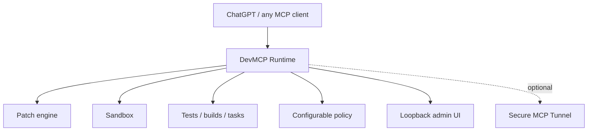

# DevMCP Runtime

Local sandboxed coding runtime for MCP clients, with configurable permissions,
surgical patching, test/build workflows, and optional ChatGPT Developer Mode
integration through Secure MCP Tunnel.

> This is an independent open-source project and is not affiliated with,
> endorsed by, or supported by OpenAI.

## What is this?

DevMCP Runtime gives an MCP client a local coding workspace with an explicit
policy, a patch engine, registered tasks, sandboxed process execution, approval
records, and a small local admin UI.



## Why use it?

- Keep the authoritative workspace separate from runtime state.
- Let small, registered coding tasks run automatically while risky operations
  create an exact, replay-resistant approval request.
- Use Safe, Balanced, Power, or a fully data-driven Custom policy.
- Inspect patches, audit events, services, and approvals locally.
- Connect any MCP client; ChatGPT Developer Mode is documented as one optional
  integration, not the product identity.

## Quickstart (Linux)

Prerequisites: Python 3.11+, Git, and bubblewrap (`bwrap`). A supported
`tunnel-client` is optional for local-only use.

Before the first PyPI publication, install directly from the current source
repository:

```bash
uv tool install git+https://github.com/GolovIaroslav/devmcp-runtime.git
devmcp setup --workspace /absolute/path/to/project --no-tunnel
devmcp doctor
devmcp status
devmcp ui
```

After `devmcp-runtime` is deliberately published to PyPI with trusted
publishing configured, the release-path command will be:

```bash
uv tool install devmcp-runtime
```

The UI is available at `http://127.0.0.1:47158`. The local MCP server uses
`127.0.0.1:47157`. For a source checkout, use
`uv pip install -e '.[dev]'` and run `devmcp setup` from the checkout.

For ChatGPT, follow [docs/CHATGPT.md](docs/CHATGPT.md). It requires a supported
Business, Enterprise, or Edu workspace with Developer Mode and a separately
installed Secure MCP Tunnel client.

For long-running autonomous coding loops, see the
[autonomous continuation protocol](docs/AGENT_AUTONOMY.md), including bounded
external waits, durable non-secret checkpoints, and terminal-state rules.

### ChatGPT permissions and DevMCP policy are separate

The ChatGPT app permission and DevMCP's local policy are two independent layers:

- ChatGPT app permissions decide whether ChatGPT asks before invoking an app
  action.
- DevMCP policy and approvals decide whether the local runtime allows, asks for,
  or denies the operation.

For the full MCP write/modify workflow, current OpenAI requirements are ChatGPT
Business, Enterprise, or Edu, ChatGPT on the web, Developer Mode, and Secure MCP
Tunnel for a local/private MCP server. ChatGPT Pro currently supports custom MCP
read/fetch access, not this full coding-agent write workflow. See the [current
OpenAI guidance](https://help.openai.com/en/articles/12584461-developer-mode-and-full-mcp-connectors-in-chatgpt).

ChatGPT app permission modes are `Always ask`, `Any changes`, `Important
actions`, and `Never ask`. `Important actions` is normally why prompts appear
intermittently: reads and low-risk actions may run automatically while higher-
impact actions ask. If the ChatGPT workspace exposes an app-specific choice,
users who intentionally trust their local DevMCP instance can select `Never
ask` for that app. Managed Business, Enterprise, and Edu workspaces may have
persistent app permissions controlled by an administrator.

`Never ask` disables ordinary ChatGPT app confirmation prompts, so use it only
with an MCP server you trust. Especially risky actions may still be blocked by
ChatGPT. DevMCP cannot programmatically disable ChatGPT approval prompts; its
own local policy remains independent.

## Features

| Area | Behavior |
| --- | --- |
| Workspace | normalized relative paths, symlink-escape checks, Git inspection |
| Patching | preview, baseline checks, atomic writes, rollback on commit failure |
| Execution | argv-based registered tasks, `shell=False` by default, bounded output |
| Sandbox | bubblewrap preferred on Linux; unsafe host mode is explicit and visible |
| Approvals | expiry, exact operation digest, one-time consumption, stale cleanup |
| Operations | structured logs and local audit records without secret values |
| UI | loopback dashboard, policy matrix, approvals, diagnostics, service status |

## Permission profiles

| Profile | Default behavior |
| --- | --- |
| Safe | read-only inspection and safe registered checks; delete/move require approval |
| Balanced | default public profile; small coding loops auto-run, risky work asks |
| Power | more local sandbox capabilities auto-run; host-boundary protections remain |
| Custom | every capability is explicitly `AUTO`, `ASK`, or `DENY` |

Change profiles with `devmcp policy profile balanced` or in the UI. The model
cannot add workspace roots or weaken the minimum host-security floor through
MCP operations.

## Safety Boundary

Even Power does not authorize path traversal, symlink escape, arbitrary host
filesystem access, access to `~/.ssh` or `~/.aws`, privilege escalation, daemon
sockets, silent workspace replacement, or exposure of runtime secrets. Linux
with bubblewrap is the supported security platform. macOS is experimental and
core-only without an equivalent sandbox; Windows is experimental for protocol
and selected workflows, not a bubblewrap-equivalent security claim.

## Supported clients and integrations

The MCP core is vendor-neutral. ChatGPT Developer Mode via Secure MCP Tunnel is
an optional integration; see [docs/CHATGPT.md](docs/CHATGPT.md). No OpenAI logo
or OpenAI product branding is used as the project identity.

## Screenshots and demo

This beta does not claim screenshots or benchmark results that are not checked
into the repository. Before public launch, capture real screenshots of:

1. Balanced dashboard with MCP health and sandbox state;
2. Permissions matrix and a changed Custom rule;
3. Approval queue with an exact operation summary;
4. ChatGPT app in draft/development mode after `Scan Tools`.

The deterministic coding-loop fixture is in `tests/compliance/fixtures`; run
`make dogfood-smoke` to exercise the read → failing test → surgical patch →
passing test → Git diff workflow. Run `make dogfood-self` for the stronger
temporary-Git-clone target, including 10k-line ranged reads/searches, Git
inspection, multi-file patching, lint/typecheck, and job lifecycle checks.

## Dogfood and benchmarks

`make dogfood-smoke` is the release smoke. Existing SWE-bench material is
historical evidence, not a beta performance guarantee; see `docs/swe-bench.md`.

## Project status

This branch prepares `v0.1.0-beta.1`. Read [CHANGELOG.md](CHANGELOG.md),
[ROADMAP.md](ROADMAP.md), and [docs/RELEASE.md](docs/RELEASE.md) for the
release gates and known limitations.

## Contributing and support

Read [CONTRIBUTING.md](CONTRIBUTING.md) before opening a pull request. Report
security issues privately according to [SECURITY.md](SECURITY.md); general
questions belong in [SUPPORT.md](SUPPORT.md).

## License and attribution

Apache-2.0. This project derives from `xyTom/coding-tools-mcp`; see
[NOTICE](NOTICE), [LICENSE](LICENSE), and
[THIRD_PARTY_NOTICES.md](THIRD_PARTY_NOTICES.md).
