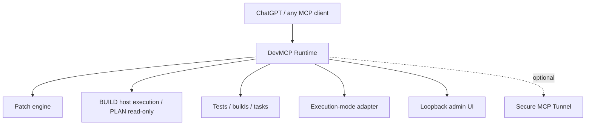

# DevMCP Runtime

Local coding runtime for MCP clients. BUILD is the default and runs with the
current OS user's filesystem, environment, and network authority; PLAN is
read-only. The selected project is coding context, not a BUILD filesystem
security boundary. Optional ChatGPT Developer Mode integration is available
through Secure MCP Tunnel.

> This is an independent open-source project and is not affiliated with,
> endorsed by, or supported by OpenAI.

## What is this?

DevMCP Runtime gives an MCP client a local coding context, patch engine,
registered tasks, direct BUILD process execution, PLAN read-only operation,
and a small local admin UI. High-level Git tools remain scoped to the selected
project even though BUILD filesystem operations follow normal OS permissions.



## Why use it?

- Keep the authoritative workspace separate from runtime state.
- Run registered coding tasks under the resolved PLAN/BUILD execution mode.
- Use PLAN for read-only inspection or the default BUILD mode for normal local coding work.
- Inspect patches, runtime status, services, and diagnostics locally.
- Connect any MCP client; ChatGPT Developer Mode is documented as one optional
  integration, not the product identity.

## Quickstart (Linux)

Prerequisites: Python 3.11+ and Git. A supported `tunnel-client` is optional for
local-only use. Bubblewrap is not required for normal BUILD execution.

Before the first PyPI publication, install directly from the current source
repository:

```bash
uv tool install git+https://github.com/GolovIaroslav/devmcp-runtime.git
devmcp setup --workspace /absolute/path/to/project --no-tunnel
devmcp doctor
devmcp status
devmcp ui
```

After `devmcp-runtime` is deliberately published to PyPI with trusted
publishing configured, the release-path command will be:

```bash
uv tool install devmcp-runtime
```

The UI is available at `http://127.0.0.1:47158`. The local MCP server uses
`127.0.0.1:47157`. For a source checkout, use
`uv pip install -e '.[dev]'` and run `devmcp setup` from the checkout.

For ChatGPT, follow [docs/CHATGPT.md](docs/CHATGPT.md). It requires a supported
Business, Enterprise, or Edu workspace with Developer Mode and a separately
installed Secure MCP Tunnel client.

For long-running autonomous coding loops, see the
[autonomous continuation protocol](docs/AGENT_AUTONOMY.md), including bounded
external waits, durable non-secret checkpoints, and terminal-state rules.

### ChatGPT permissions and DevMCP execution modes are separate

The ChatGPT app permission and DevMCP's local execution mode are independent layers:

- ChatGPT app permissions decide whether ChatGPT asks before invoking an app
  action.
- DevMCP resolves PLAN/BUILD at startup. PLAN is read-only; BUILD uses the
  current OS user's authority and does not add per-command approval gates.

For the full MCP write/modify workflow, current OpenAI requirements are ChatGPT
Business, Enterprise, or Edu, ChatGPT on the web, Developer Mode, and Secure MCP
Tunnel for a local/private MCP server. ChatGPT Pro currently supports custom MCP
read/fetch access, not this full coding-agent write workflow. See the [current
OpenAI guidance](https://help.openai.com/en/articles/12584461-developer-mode-and-full-mcp-connectors-in-chatgpt).

ChatGPT app permission modes are `Always ask`, `Any changes`, `Important
actions`, and `Never ask`. `Important actions` is normally why prompts appear
intermittently: reads and low-risk actions may run automatically while higher-
impact actions ask. If the ChatGPT workspace exposes an app-specific choice,
users who intentionally trust their local DevMCP instance can select `Never
ask` for that app. Managed Business, Enterprise, and Edu workspaces may have
persistent app permissions controlled by an administrator.

`Never ask` disables ordinary ChatGPT app confirmation prompts, so use it only
with an MCP server you trust. Especially risky actions may still be blocked by
ChatGPT. DevMCP cannot programmatically disable ChatGPT approval prompts.

## Features

| Area | Behavior |
| --- | --- |
| Workspace | selected project as default coding context/cwd; absolute BUILD paths follow OS permissions |
| Patching | preview, baseline checks, atomic writes, rollback on commit failure |
| Execution | BUILD runs direct current-user processes; PLAN is read-only; output remains bounded |
| Git | high-level Git tools remain scoped to the selected repository |
| Operations | structured logs and local audit records without secret values |
| UI | loopback dashboard, diagnostics, service status |

## Execution modes

| Mode | Behavior |
| --- | --- |
| PLAN | read-only runtime behavior |
| BUILD | default; full access under the current OS user's filesystem, environment, and network authority |

Legacy `permission_mode=safe|trusted|dangerous` inputs remain only as a thin
compatibility adapter: `safe -> PLAN`, while `trusted` and `dangerous -> BUILD`.

## Safety Boundary

BUILD is not a filesystem sandbox: DevMCP executes as the current OS user and
the operating system remains the authority boundary. The selected repository
is context for coding and high-level Git tools, not a filesystem security root.
PLAN remains the read-only mode. Transactional or external executor machinery
may use isolation separately; that is not the normal BUILD execution model.

## Supported clients and integrations

The MCP core is vendor-neutral. ChatGPT Developer Mode via Secure MCP Tunnel is
an optional integration; see [docs/CHATGPT.md](docs/CHATGPT.md). No OpenAI logo
or OpenAI product branding is used as the project identity.

## Screenshots and demo

This beta does not claim screenshots or benchmark results that are not checked
into the repository. Before public launch, capture real screenshots of:

1. Runtime dashboard with MCP health and BUILD/PLAN state;
2. BUILD status showing current-user authority and no active sandbox;
3. Selected-project context alongside high-level Git status;
4. ChatGPT app in draft/development mode after `Scan Tools`.

The deterministic coding-loop fixture is in `tests/compliance/fixtures`; run
`make dogfood-smoke` to exercise the read → failing test → surgical patch →
passing test → Git diff workflow. Run `make dogfood-self` for the stronger
temporary-Git-clone target, including 10k-line ranged reads/searches, Git
inspection, multi-file patching, lint/typecheck, and job lifecycle checks.

## Dogfood and benchmarks

`make dogfood-smoke` is the release smoke. Existing SWE-bench material is
historical evidence, not a beta performance guarantee; see `docs/swe-bench.md`.

## Project status

This branch prepares `v0.1.0-beta.1`. Read [CHANGELOG.md](CHANGELOG.md),
[ROADMAP.md](ROADMAP.md), and [docs/RELEASE.md](docs/RELEASE.md) for the
release gates and known limitations.

## Contributing and support

Read [CONTRIBUTING.md](CONTRIBUTING.md) before opening a pull request. Report
security issues privately according to [SECURITY.md](SECURITY.md); general
questions belong in [SUPPORT.md](SUPPORT.md).

## License and attribution

Apache-2.0. This project derives from `xyTom/coding-tools-mcp`; see
[NOTICE](NOTICE), [LICENSE](LICENSE), and
[THIRD_PARTY_NOTICES.md](THIRD_PARTY_NOTICES.md).
