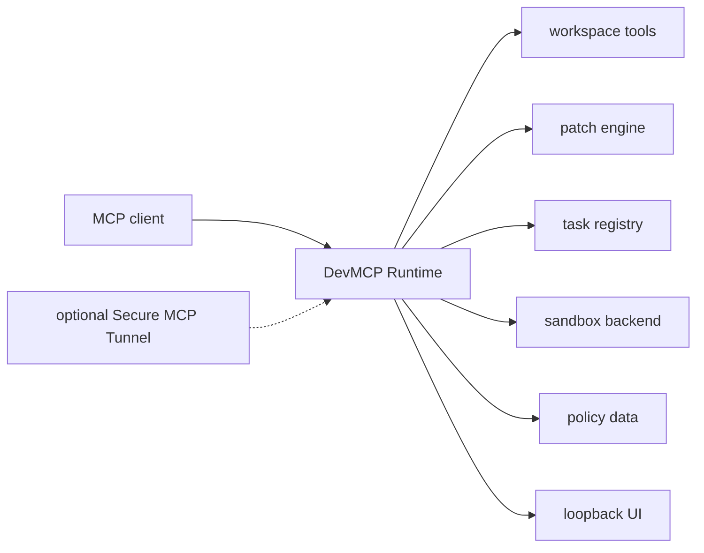

# Architecture

The authoritative workspace is selected by configuration. Runtime state,
approval DB, audit log, config, and secrets live outside it. The model can use
workspace tools but cannot modify runtime policy or silently add roots.

The exposed MCP catalog has a schema version. Workflow breadth belongs in the
task registry and configuration, so clients do not need a new tool schema for
every supported ecosystem.
